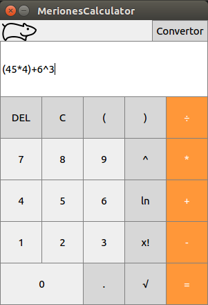

<div align="center">
    <h1>Meriones Calculator</h1>
    <p>BUT FIT - IVS Project 2</p>
    <p>
    
    <br>
    </p>
</div>

# IVS Project 2

A simple calculator with GUI, documentation, manual, it's own math library and installer.

## About

The project was intended to show us the entire process of creating software (not
just programming) while also teaching us the basics of working in a team.

### Assignment

The project assignment (in czech) can be found [here](http://ivs.fit.vutbr.cz/projekt-2_tymova_spoluprace2017-18.html)

## Getting Started

If you don't intend to edit or view the code just install the calculator
[here](#install-from-package).
Otherwise clone the directory

```
git clone https://github.com/Toaster192/Ivs_team_project.git
```

## Install from package

### Prerequisites

This instalation will only work if your Linux distribution supports debian
packages (Ubuntu, debian etc.)

All the required software should be included.

### Installing

Download the .deb package [here](https://github.com/Toaster192/Ivs_team_project/releases/tag/v1.0).

Navigate to the folder where the package is and

```
apt install ./meriones_installer.deb
```

Then to run the program use the command

```
meriones-calculator
```

## Built With

* [Python](https://www.python.org/) - The programming language used
* [PyQt](https://wiki.python.org/moin/PyQt) - Used for the GUI

## Authors

* **Ondřej Kinšt** - [Toaster192](https://github.com/Toaster192)
* **Jaromír Wysoglad** - [vyzigold](https://github.com/vyzigold)
* **Silvie Chlupová** - [schlupov](https://github.com/schlupov)
* **Ivana Saranová** - [isaranova](https://github.com/isaranova)

## License

This project is licensed under the GNU GPL v.3 License.
